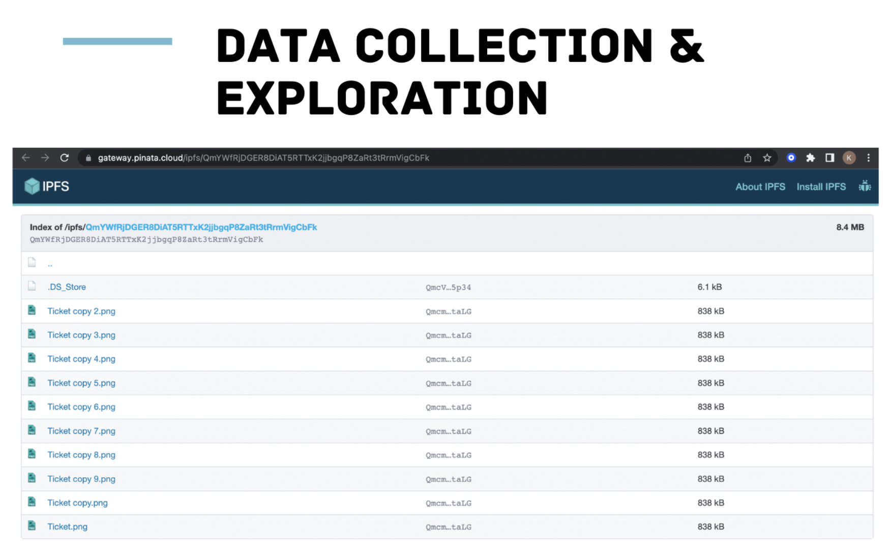
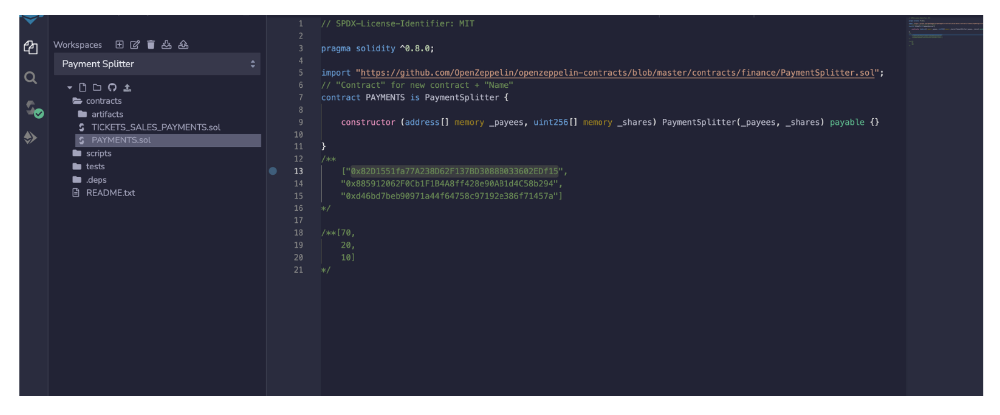
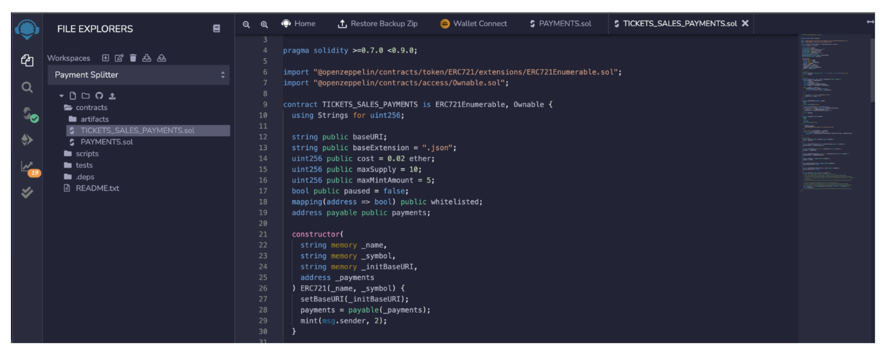
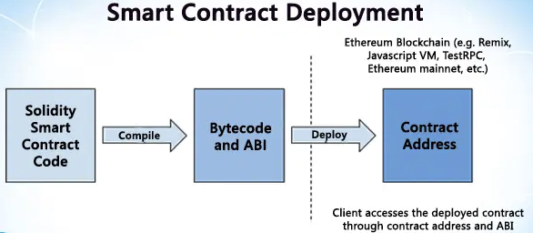

# Payment-Splitter-Token-Dapp-Launch


Using Remix IDE and MetaMask to connect and deploy on the Rinkeby Test network, I have created two Solidity Smart Contracts: ProfitSplitter and TicketSales. 

The "PAYMENTS" contract is responsible for accepting incoming Ether from the "TICKET_SALES" contract and dividing it among investors based on their profit shares. This ensures the DAO's peace of mind and efficient payment processing.

Similarly, the "TICKET_SALES_PAYMENTS" contract accepts Ether after each sale or mint and sends the proceeds to the "PAYMENTS" contract for fair distribution among investors.


Smart Contracts functionalities:

- Pay the Investors quickly and easily.

- Distribute profits from Token sales to Investors into three profit shares (70,20,10)%.

- Distribution of profits after each Token(Ticket) sale is not automated.

- Investors will use the PullMethod function to release the ETH shares allow to them. 


${\color{red}IMPORTANT}$ ${\color{red}TO}$ ${\color{red}NOTE}$ ${\color{red}BOTH}$ ${\color{red}CONTRACTS}$ ${\color{red}WILL}$ ${\color{red}OPERATE}$ ${\color{red}SEPARATELY}$ ${\color{red}THE}$ ${\color{red}BLOCKCHAIN}$


# Token - Tickets metadata storage




- [IPFS](https://ipfs.io/)

- [Pinata](https://www.pinata.cloud/)


# Smart Contracts 

${\color{green}PAYMENTS}$ ${\color{green}Contract}$



The "PAYMENTS" contract has been successfully deployed, which enables incoming Ether from "TICKET_SALES" to be received and divided proportionally amongst investors based on their profit share. By implementing this feature, the DAO can receive payments in a timely and efficient manner, ensuring peace of mind for all parties involved. As an illustration, Investor #1 will receive 70% of the payment, Investor #2 will receive 20%, and Investor #3 will receive 10%.

${\color{green}TICKETS}$ ${\color{green}SALES}$ ${\color{green}Contract}$



The "TICKETS_SALES_PAYMENTS" contract has been implemented to facilitate Ether payments for each sale/mint operation. This contract receives Ether and forwards the proceeds to the "PAYMENTS" contract.


# Instructions 

``` 
The withdraw method pushes all the ETH to the payable line 118 address —> (msg.sender) 
```
``` 
Created a new variable called “address“ in line 25 payable to public “payments”
```
``` 
To initialize it I added in the constructor line 31 “address” _payments
```
```
Line 34 made payment =  payable(_payments)
```

```
Replaced “msg.sender” with the address of the deployed payment contract
```

```
Used the ABI from the smart contract "payment splitter contract" for the Minting DApp
```
```
Used the Environment: injected Web3  "Rinkeby Test Network"
```

# To Preview

## ABI

[ABIs](https://www.alchemy.com/overviews/what-is-an-abi-of-a-smart-contract-examples-and-usage)  define a standard mechanism for interacting with smart contracts. These are basically human-readable interfaces that enable us to interact with the complicated EVM bytecode of a smart contract.
These interfaces are extremely crucial as they enable interactions between applications and smart contracts or even contracts to contracts. These details are then used to encode contract calls that are made to the EVM so that the virtual machine can read, understand and execute these instructions.

<p align="center">                        
  
   </a>
</p>

```
ABI on minting app - Config file —> Abi.json —> config.json
```
```
Withdraw from the "withdraw" function in the "TICKETS" contract 
```
```
Release(method) ETH payment - by copying the address connected to the EVM In the "Deployed and released" section and the amount of the ETH should go up, based on the shares allocated.
```

- [Powerpoint](https://github.com/kissikelvin/Payment-Splitter-Token-Dapp-Launch/blob/main/Powerpoint-Presentation/SALES%20TICKETS%20-%20PROFIT%20PAYMENT%20SPLITTER%20.pdf)

